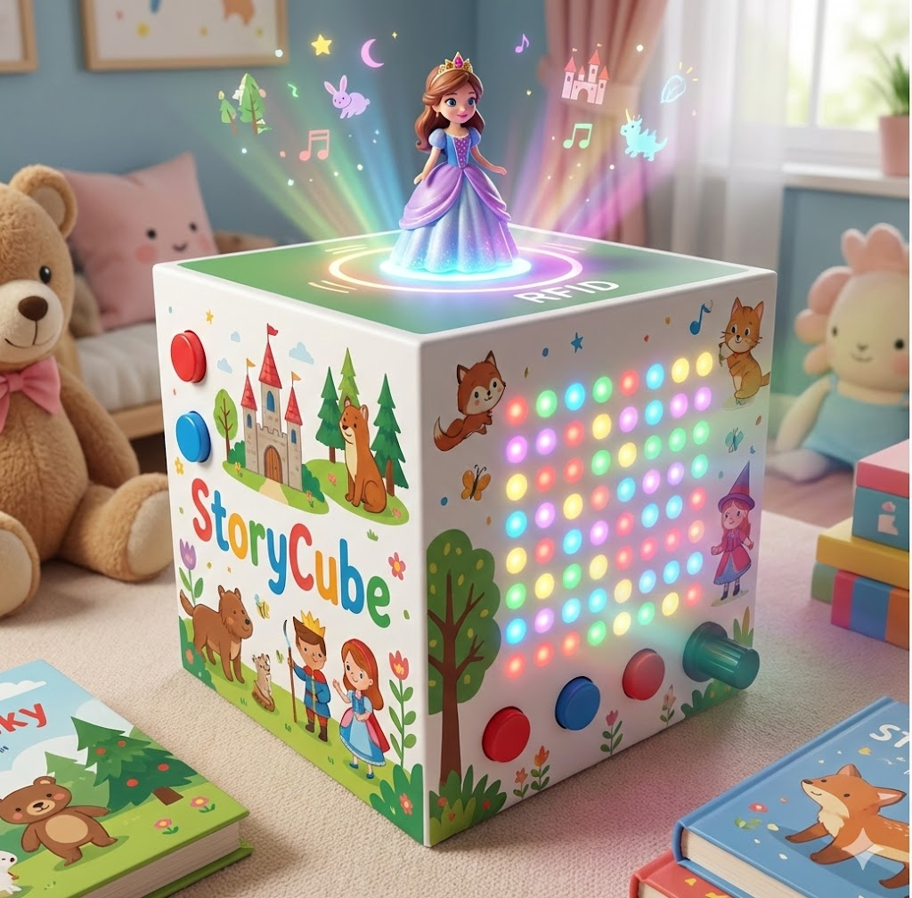

# STORYCUBE

## Introducción
Este repositorio tiene los archivos y la información detallada para poder desarrollar un cubo interactivo educativo que fomente el aprendizaje y la lectura en niños mediante tecnología RFID y estímulos visuales y auditivos.

## Software
  - Visual Studio Code con extensión PlatformIO
  - Android Studio (para desarrollo de app)

## Instalación 
- [Instalación del makefile](./Makefile) - Permite compilar el proyecto desde su código fuente en caso de que se desee replicar o modificar el sistema.

## Tabla de Contenido
  - [Componentes](#Componentes)
  - [Diagramas](#Diagramas)
      - [Bloques](#Bloques)
      - [Estados](#Estados)
      - [Sistema en Fritzing](#Sistema)
  - [Estructura de la carpeta MP3](##Carpeta_MP3)
  - [Instalación App](#APP)
  - [Funcionamiento/Uso](#Funcionamiento/Uso)
      - [Inicio del sistema](#)
      - [Cambio de modos](#)
  - [Autores](#Autores)

## Componentes
   - Placa electrónica ESP32 (1 unidad)
   - Módulo RFID RC522 (1 unidad)
   - Llaveros RFID (6 Unidades)
    Va a depender de como se configure el codigo o si se quiere mandar a una escala coleccionable se puede expandir ese número.
   - Matriz WS2812B(8x8) (1 unidad)
   - DFPlayer MP3 Mini (1 unidad)
   - Micro SD 16GB (1 unidad)
    Si se llegase a extender los cuentos con muñecos coleccionables, la memoria abastecería por el poco espacio que ocupan los audios.
   - Teclado de membrana matricial(3x4) (1 unidad)
   - Mini Parlante 8 ohmios (1 unidad)
    El tamaño del parlante va a variar dependiendo de su calidad por lo que se tiene que tener en cuenta las dimensiones
   - Boton Pulsador ( 6 unidades)
     - 3 botones para reanudar, retroceder, pausa
     - 1 boton para on/off
     - 2 botones para subir y bajar volumen
   - Borneras (7 unidades)
    Exclusivas para los botones y se tomaron en cuenta borneras para que no ocurra falso contacto.
   - Espadines macho y hembra (variable)
     - 2 espadines macho y hembra para conexiones entre el SM5308 Y PCB.
     - 3 espadines macho y hembra para conexiones entre matriz Led y PCB.
     - 7 espadines macho y hembra para conexiones entre el teclado 3x4 y PCB.
     - 8 espadines macho y hembra para conexiones entre RFID y PCB.
      - Resistencias (4 unidades)
     - Por composición de la PCB sirven para mejorar la calidad de audio y para conectar componentes. 
   - Potenciómetro 10K (1 unidad)
     - Exclusivo para el brillo de la pantalla.
   - Modulo SM5308 (1 unidad)
     - Unidad de carga conectado a su boton pulsador para manejo de on/off. 
   - Baterias Litio 3.7V Recargables (2 unidades)
    Conectadas al modulo SM5308 en paralelo para sumar su corriente y mantener el voltaje en 3.7V.
> Los espadines se pueden obviar junto con las borneras, se puede soldar directamente a la placa PCB, así se reduce el grosor de la placa PCB y abatar costos junto con espacio.
## Diagramas

### Bloques

### Estados

### Sistema

  
  **Consideraciones:**  Tener en cuenta que en este esquemático se utiliza el puerto de carga **TP4056**; sin embargo, para la implementación física se empleó el módulo de carga **SM5308**, el cual opera mediante un pulsador. Por esta razón, se incorporó un pulsador como elemento activador de todo el proyecto.

## Carpeta_MP3
En esta sección se explica cómo está organizada la carpeta "MP3" de la tarjeta SD utilizada en el módulo DFPlayer Mini.

Para ver la lista completa de archivos de audio y su organización, consulta el documento: [Estructura detallada de MP3](./MP3_STRUCTURE.md) 

## APP
- [Descargar la aplicación](./STORYCUBE.apk) - Descarga la app para instalar en tu dispositivo movil. 
- [Manual de uso](./MANUAL_APPSTORYCUBE.md) - Guía completa sobre cómo utilizar la aplicación
  
## Funcionamiento / Uso

**Encendido/Apagado:** Presiona una vez para encender, dos veces para apagar.

**Inicio:** El dispositivo se conecta a WiFi automáticamente. Cuando aparezca "STORYCUBE" en la matriz LED, estará listo en MODO RFID.

**Cambio de modos** (presionando "*" en el teclado matricial):
- **MODO RFID:** Coloca los muñecos RFID para reproducir sus cuentos automáticamente
- **MODO MANUAL:** Navega cuentos con "Siguiente" y "Atrás"
- **MODO NÚMEROS:** Presiona números para escuchar su audio. Cambia idioma (español/inglés) con "#"
- **MODO COLORES:** Selecciona colores del 1 al 6 para escuchar su audio
- Presiona "*" nuevamente para volver al MODO RFID

## Autores
  - Sebastian Huayamave
  - Steven Yari
